# project management system for web agency

## Описание
Дипломная работа (ворд файл есть в репозитории).
Информационная система по управлению проектами и задачами вебстудии.
Роутов и возможностей в бекенде больше нежели представленно во фронте и инсомния файле (можно посмотреть в сервисах каждой сущности)

## Todo
- Адаптивная вёрстка
- возможность прикреплять картинки в rich text editor`е
- Функционал с бонусами за сайты для сотрудников
- Прикрепление скриншотов переводов из банка при оплате за проект и сотруднику

## Контакты

Если у вас возникли вопросы или предложения по проекту, вы можете связаться со мной или оставить issue на GitHub:

- **Telegram**: @comunay
- **Telephone**: +89963846503
- **GitHub**: [https://github.com/crossovka](https://github.com/crossovka)
- **Email**: [cevyacheslav@gmail.com](mailto:cevyacheslav@gmail.com) (обновите на свой реальный email)

## Скриншоты

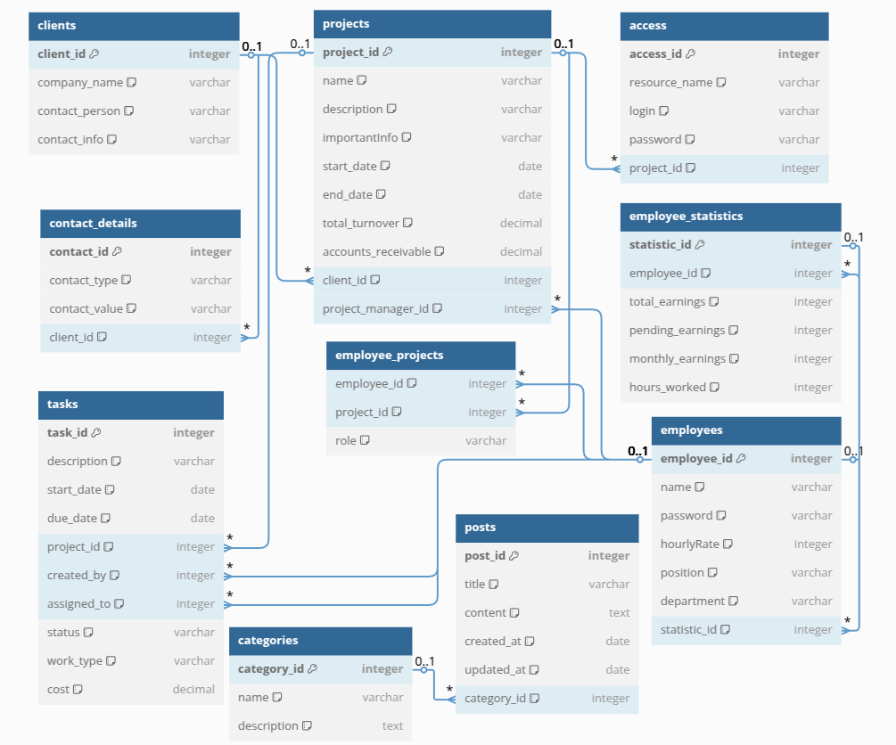
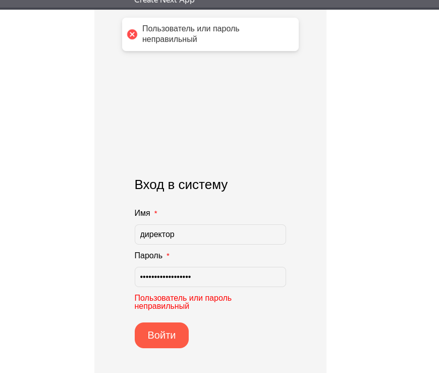
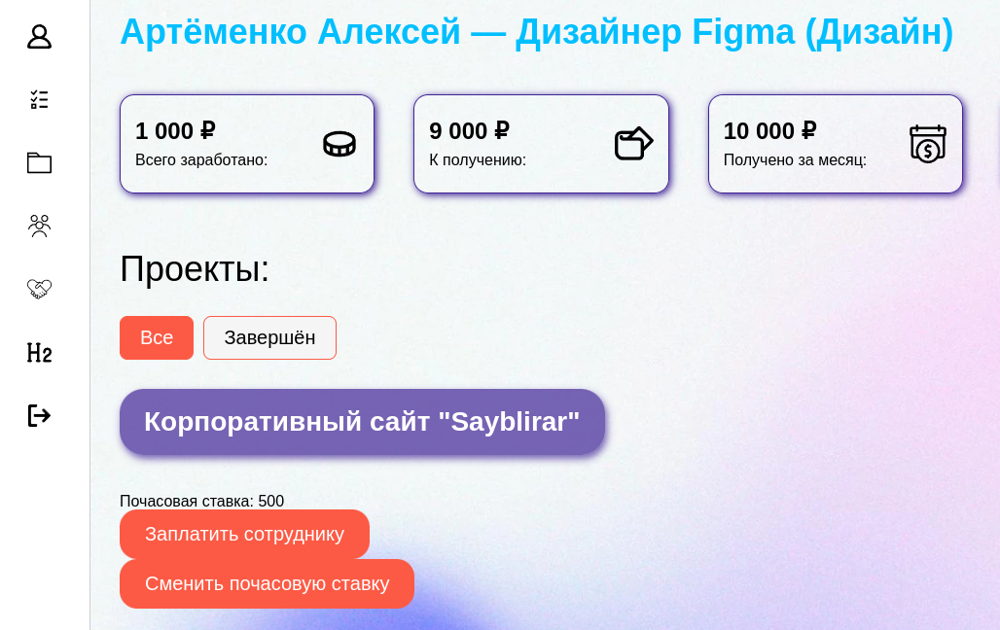
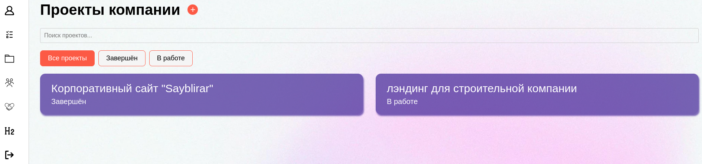
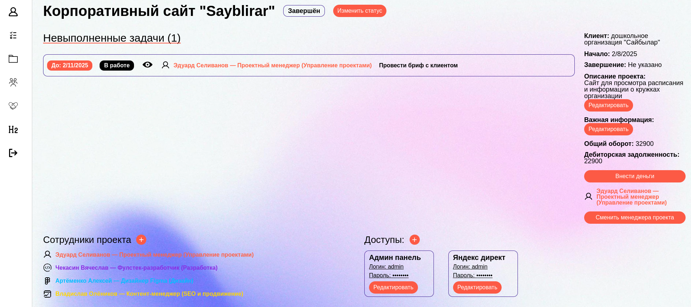
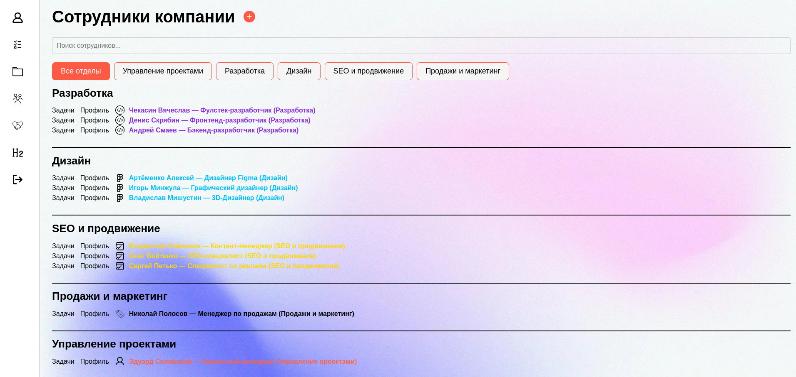
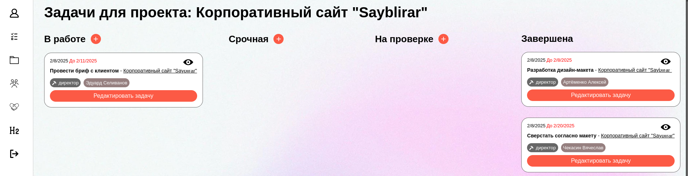
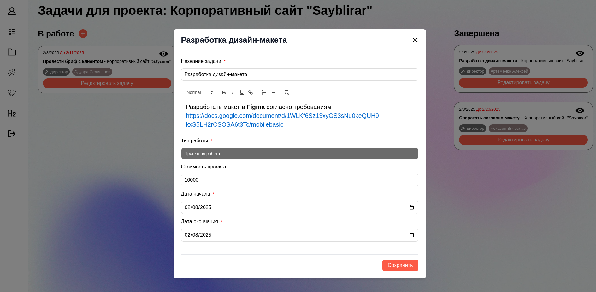
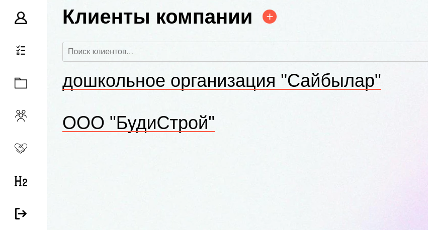
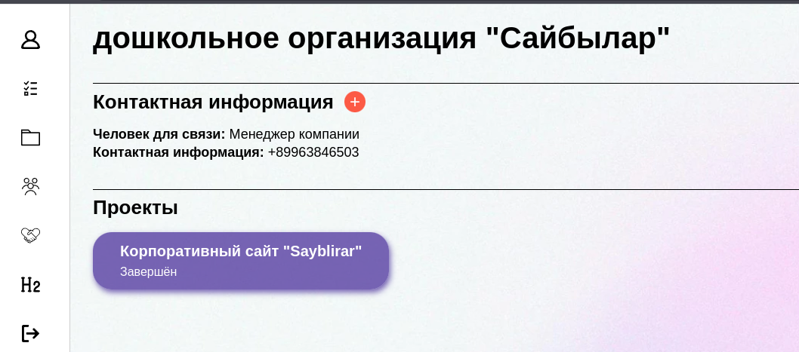
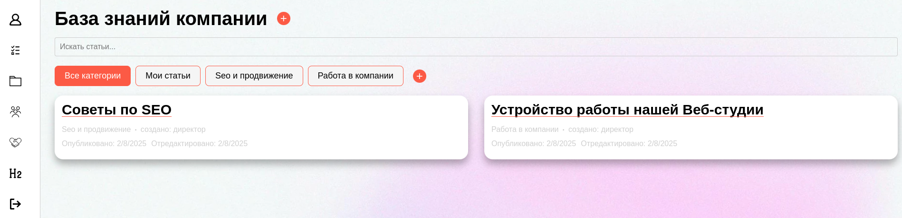
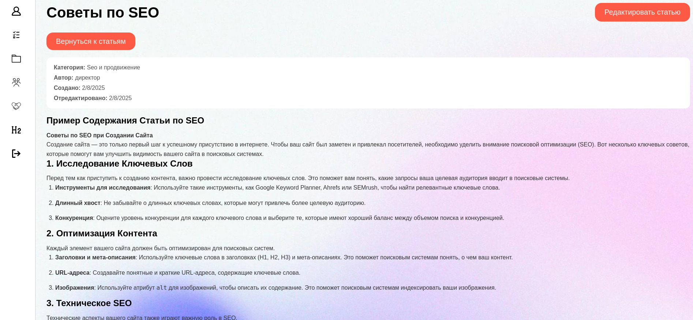
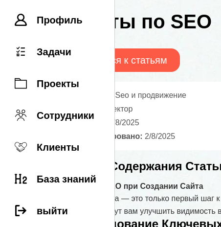

